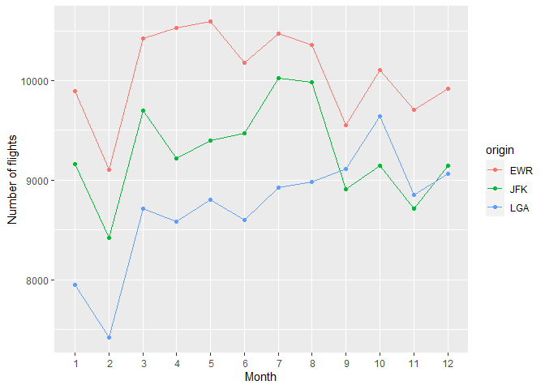
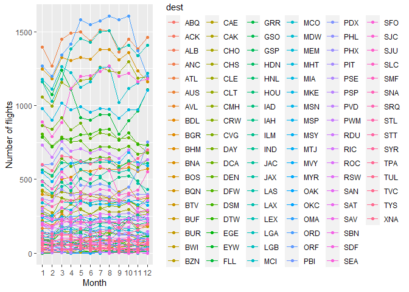
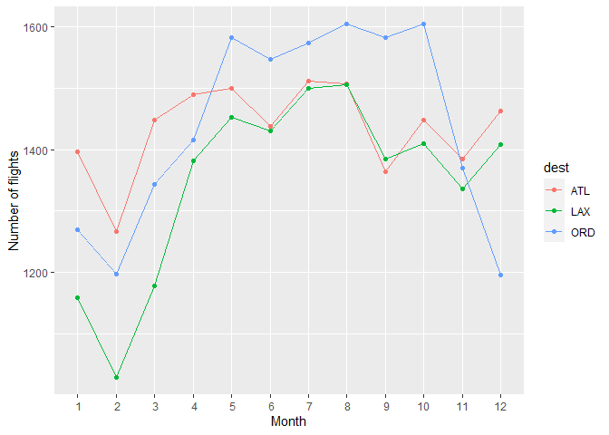
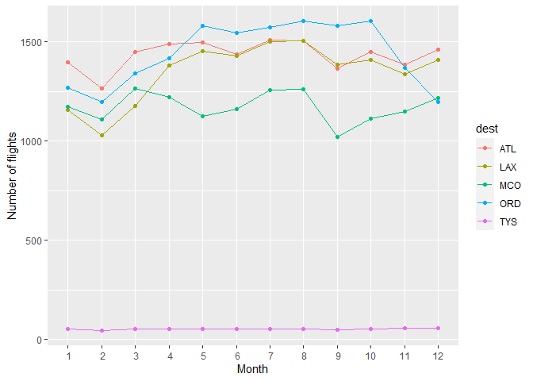
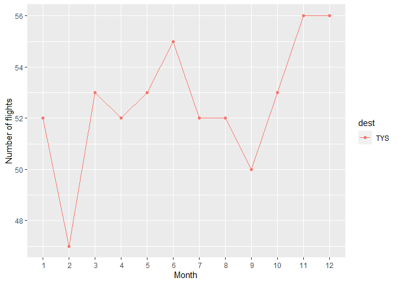
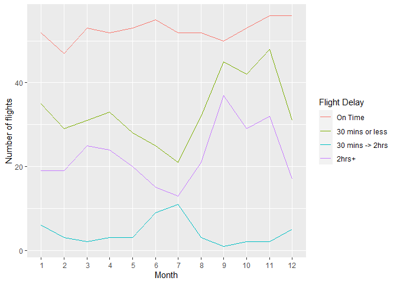

hw\_08
================
Haley Dylewski
10/14/2020

Purpose:

This document provides results of practice with 1) list element access
and manipulation using base R style as well as the tidyverse 2) Factors
and vector conversion to/from factors 3). Part 2 includes exploratory
data analysis of the nycflights13 data set with walk through and
explanation.

-----

-----

Task 1: Accessing list elements

-----

Create a list using list() with at least 3 named elements

``` r
library(tidyverse)
```

    ## -- Attaching packages -------------------- tidyverse 1.3.0 --

    ## v ggplot2 3.3.2     v purrr   0.3.4
    ## v tibble  3.0.3     v dplyr   1.0.2
    ## v tidyr   1.1.2     v stringr 1.4.0
    ## v readr   1.3.1     v forcats 0.5.0

    ## -- Conflicts ----------------------- tidyverse_conflicts() --
    ## x dplyr::filter() masks stats::filter()
    ## x dplyr::lag()    masks stats::lag()

``` r
my_list <- list(c("Yellow","Purple", "Rice"), c(16, 25), list(FALSE, 18))

names(my_list) <- c("Some Text", "Lucky Numbers", "Extra Data")

str(my_list)
```

    ## List of 3
    ##  $ Some Text    : chr [1:3] "Yellow" "Purple" "Rice"
    ##  $ Lucky Numbers: num [1:2] 16 25
    ##  $ Extra Data   :List of 2
    ##   ..$ : logi FALSE
    ##   ..$ : num 18

Access the 1st element by name

``` r
my_list[["Some Text"]]
```

    ## [1] "Yellow" "Purple" "Rice"

Access the 2nd element using \[\[,

``` r
my_list[[2]]
```

    ## [1] 16 25

Access the 3rd element as a list using \[

``` r
my_list[3]
```

    ## $`Extra Data`
    ## $`Extra Data`[[1]]
    ## [1] FALSE
    ## 
    ## $`Extra Data`[[2]]
    ## [1] 18

-----

Using mtcars

``` r
str(mtcars)
```

    ## 'data.frame':    32 obs. of  11 variables:
    ##  $ mpg : num  21 21 22.8 21.4 18.7 18.1 14.3 24.4 22.8 19.2 ...
    ##  $ cyl : num  6 6 4 6 8 6 8 4 4 6 ...
    ##  $ disp: num  160 160 108 258 360 ...
    ##  $ hp  : num  110 110 93 110 175 105 245 62 95 123 ...
    ##  $ drat: num  3.9 3.9 3.85 3.08 3.15 2.76 3.21 3.69 3.92 3.92 ...
    ##  $ wt  : num  2.62 2.88 2.32 3.21 3.44 ...
    ##  $ qsec: num  16.5 17 18.6 19.4 17 ...
    ##  $ vs  : num  0 0 1 1 0 1 0 1 1 1 ...
    ##  $ am  : num  1 1 1 0 0 0 0 0 0 0 ...
    ##  $ gear: num  4 4 4 3 3 3 3 4 4 4 ...
    ##  $ carb: num  4 4 1 1 2 1 4 2 2 4 ...

Access mpg column by name(2 ways) and \[\[ syntax

``` r
mtcars[["mpg"]]
```

    ##  [1] 21.0 21.0 22.8 21.4 18.7 18.1 14.3 24.4 22.8 19.2 17.8 16.4 17.3 15.2 10.4
    ## [16] 10.4 14.7 32.4 30.4 33.9 21.5 15.5 15.2 13.3 19.2 27.3 26.0 30.4 15.8 19.7
    ## [31] 15.0 21.4

``` r
mtcars$mpg
```

    ##  [1] 21.0 21.0 22.8 21.4 18.7 18.1 14.3 24.4 22.8 19.2 17.8 16.4 17.3 15.2 10.4
    ## [16] 10.4 14.7 32.4 30.4 33.9 21.5 15.5 15.2 13.3 19.2 27.3 26.0 30.4 15.8 19.7
    ## [31] 15.0 21.4

``` r
mtcars[[1]]
```

    ##  [1] 21.0 21.0 22.8 21.4 18.7 18.1 14.3 24.4 22.8 19.2 17.8 16.4 17.3 15.2 10.4
    ## [16] 10.4 14.7 32.4 30.4 33.9 21.5 15.5 15.2 13.3 19.2 27.3 26.0 30.4 15.8 19.7
    ## [31] 15.0 21.4

Use base R to create a new column for ‘displacement per cylinder’, that
contains the engine displacement divided by number of cylinders

``` r
mtcars_base <- mtcars
mtcars_base$diplacement_per_cylinder<- round( mtcars_base$disp/mtcars_base$cyl)
glimpse(mtcars_base)
```

    ## Rows: 32
    ## Columns: 12
    ## $ mpg                      <dbl> 21.0, 21.0, 22.8, 21.4, 18.7, 18.1, 14.3, ...
    ## $ cyl                      <dbl> 6, 6, 4, 6, 8, 6, 8, 4, 4, 6, 6, 8, 8, 8, ...
    ## $ disp                     <dbl> 160.0, 160.0, 108.0, 258.0, 360.0, 225.0, ...
    ## $ hp                       <dbl> 110, 110, 93, 110, 175, 105, 245, 62, 95, ...
    ## $ drat                     <dbl> 3.90, 3.90, 3.85, 3.08, 3.15, 2.76, 3.21, ...
    ## $ wt                       <dbl> 2.620, 2.875, 2.320, 3.215, 3.440, 3.460, ...
    ## $ qsec                     <dbl> 16.46, 17.02, 18.61, 19.44, 17.02, 20.22, ...
    ## $ vs                       <dbl> 0, 0, 1, 1, 0, 1, 0, 1, 1, 1, 1, 0, 0, 0, ...
    ## $ am                       <dbl> 1, 1, 1, 0, 0, 0, 0, 0, 0, 0, 0, 0, 0, 0, ...
    ## $ gear                     <dbl> 4, 4, 4, 3, 3, 3, 3, 4, 4, 4, 4, 3, 3, 3, ...
    ## $ carb                     <dbl> 4, 4, 1, 1, 2, 1, 4, 2, 2, 4, 4, 3, 3, 3, ...
    ## $ diplacement_per_cylinder <dbl> 27, 27, 27, 43, 45, 38, 45, 37, 35, 28, 28...

Create a single column data frame using tidyverse mutate() function

``` r
mtcars_tidy <- mutate(mtcars, "Displacement by cylinder" = round(disp/cyl))

glimpse(mtcars_tidy)
```

    ## Rows: 32
    ## Columns: 12
    ## $ mpg                        <dbl> 21.0, 21.0, 22.8, 21.4, 18.7, 18.1, 14.3...
    ## $ cyl                        <dbl> 6, 6, 4, 6, 8, 6, 8, 4, 4, 6, 6, 8, 8, 8...
    ## $ disp                       <dbl> 160.0, 160.0, 108.0, 258.0, 360.0, 225.0...
    ## $ hp                         <dbl> 110, 110, 93, 110, 175, 105, 245, 62, 95...
    ## $ drat                       <dbl> 3.90, 3.90, 3.85, 3.08, 3.15, 2.76, 3.21...
    ## $ wt                         <dbl> 2.620, 2.875, 2.320, 3.215, 3.440, 3.460...
    ## $ qsec                       <dbl> 16.46, 17.02, 18.61, 19.44, 17.02, 20.22...
    ## $ vs                         <dbl> 0, 0, 1, 1, 0, 1, 0, 1, 1, 1, 1, 0, 0, 0...
    ## $ am                         <dbl> 1, 1, 1, 0, 0, 0, 0, 0, 0, 0, 0, 0, 0, 0...
    ## $ gear                       <dbl> 4, 4, 4, 3, 3, 3, 3, 4, 4, 4, 4, 3, 3, 3...
    ## $ carb                       <dbl> 4, 4, 1, 1, 2, 1, 4, 2, 2, 4, 4, 3, 3, 3...
    ## $ `Displacement by cylinder` <dbl> 27, 27, 27, 43, 45, 38, 45, 37, 35, 28, ...

What is the difference between these resulting vector and tibble?

-----

-----

Task 2: Factors

-----

Create a numeric vector

``` r
num.vec <- c(3, 4, 1, 5)
glimpse(num.vec)
```

    ##  num [1:4] 3 4 1 5

Use as.factor() to convert this to a factor

``` r
fac.num.vec <- as.factor(num.vec)
glimpse(fac.num.vec)
```

    ##  Factor w/ 4 levels "1","3","4","5": 2 3 1 4

Use as.numeric to convert this back to a numeric vector

``` r
num.vec.2 <- as.numeric(fac.num.vec)
glimpse(num.vec.2)
```

    ##  num [1:4] 2 3 1 4

What happened here?

It looks like the numbers were given factor levels based on their
numerical value in increasing order. When converted to a numeric, the
corresponding factor values were kept instead of the original values.

-----

-----

Task 3: Exploratory data analysis

-----

I have decided to work with the nycflights dataset. Thise data set gives
information on flights that departed from new york city.

``` r
library(nycflights13)

glimpse(flights)
```

    ## Rows: 336,776
    ## Columns: 19
    ## $ year           <int> 2013, 2013, 2013, 2013, 2013, 2013, 2013, 2013, 2013...
    ## $ month          <int> 1, 1, 1, 1, 1, 1, 1, 1, 1, 1, 1, 1, 1, 1, 1, 1, 1, 1...
    ## $ day            <int> 1, 1, 1, 1, 1, 1, 1, 1, 1, 1, 1, 1, 1, 1, 1, 1, 1, 1...
    ## $ dep_time       <int> 517, 533, 542, 544, 554, 554, 555, 557, 557, 558, 55...
    ## $ sched_dep_time <int> 515, 529, 540, 545, 600, 558, 600, 600, 600, 600, 60...
    ## $ dep_delay      <dbl> 2, 4, 2, -1, -6, -4, -5, -3, -3, -2, -2, -2, -2, -2,...
    ## $ arr_time       <int> 830, 850, 923, 1004, 812, 740, 913, 709, 838, 753, 8...
    ## $ sched_arr_time <int> 819, 830, 850, 1022, 837, 728, 854, 723, 846, 745, 8...
    ## $ arr_delay      <dbl> 11, 20, 33, -18, -25, 12, 19, -14, -8, 8, -2, -3, 7,...
    ## $ carrier        <chr> "UA", "UA", "AA", "B6", "DL", "UA", "B6", "EV", "B6"...
    ## $ flight         <int> 1545, 1714, 1141, 725, 461, 1696, 507, 5708, 79, 301...
    ## $ tailnum        <chr> "N14228", "N24211", "N619AA", "N804JB", "N668DN", "N...
    ## $ origin         <chr> "EWR", "LGA", "JFK", "JFK", "LGA", "EWR", "EWR", "LG...
    ## $ dest           <chr> "IAH", "IAH", "MIA", "BQN", "ATL", "ORD", "FLL", "IA...
    ## $ air_time       <dbl> 227, 227, 160, 183, 116, 150, 158, 53, 140, 138, 149...
    ## $ distance       <dbl> 1400, 1416, 1089, 1576, 762, 719, 1065, 229, 944, 73...
    ## $ hour           <dbl> 5, 5, 5, 5, 6, 5, 6, 6, 6, 6, 6, 6, 6, 6, 6, 5, 6, 6...
    ## $ minute         <dbl> 15, 29, 40, 45, 0, 58, 0, 0, 0, 0, 0, 0, 0, 0, 0, 59...
    ## $ time_hour      <dttm> 2013-01-01 05:00:00, 2013-01-01 05:00:00, 2013-01-0...

-----

Flight origins

-----

First, I am interested to see which originating airport in NYC had the
most air traffic in each month.

Creating a new data table that shows the number of flights for each
origin location and month.

``` r
origin_data <- flights %>%
  group_by(origin,month)%>%
  summarize(number_of_flights = n())
```

    ## `summarise()` regrouping output by 'origin' (override with `.groups` argument)

``` r
glimpse(origin_data)
```

    ## Rows: 36
    ## Columns: 3
    ## Groups: origin [3]
    ## $ origin            <chr> "EWR", "EWR", "EWR", "EWR", "EWR", "EWR", "EWR", ...
    ## $ month             <int> 1, 2, 3, 4, 5, 6, 7, 8, 9, 10, 11, 12, 1, 2, 3, 4...
    ## $ number_of_flights <int> 9893, 9107, 10420, 10531, 10592, 10175, 10475, 10...

From this data frame, the number of flights per month was plotted for
each origin location

``` r
ggplot(origin_data, aes(x = month, y = number_of_flights, color = origin)) + 
  geom_line() + geom_point() + 
  xlim(1,12) + scale_x_discrete(name = "Month", limits = c(1:12,1)) + scale_y_continuous(name = "Number of flights", labels=waiver())
```

    ## Warning: Continuous limits supplied to discrete scale.
    ## Did you mean `limits = factor(...)` or `scale_*_continuous()`?

    ## Scale for 'x' is already present. Adding another scale for 'x', which will
    ## replace the existing scale.

<!-- --> We can see
that EWR airport had the most flights in every month of the year.
Interestingly, in the 9-11th month flights dropped from JFK and rose
from LGA.

-----

Flight destinations

-----

Next, it will be interesting to see where these flights are destined and
if there is a seasonality to these destinations.

Creating a new data table that shows the number of flights for each
origin location and month.

``` r
dest_data <- flights %>%
  group_by(dest,month)%>%
  summarize(number_of_flights = n())
```

    ## `summarise()` regrouping output by 'dest' (override with `.groups` argument)

``` r
glimpse(dest_data)
```

    ## Rows: 1,113
    ## Columns: 3
    ## Groups: dest [105]
    ## $ dest              <chr> "ABQ", "ABQ", "ABQ", "ABQ", "ABQ", "ABQ", "ABQ", ...
    ## $ month             <int> 4, 5, 6, 7, 8, 9, 10, 11, 12, 5, 6, 7, 8, 9, 10, ...
    ## $ number_of_flights <int> 9, 31, 30, 31, 31, 30, 31, 30, 31, 21, 43, 66, 67...

Similar to with flight origin, we can create a plot showing flight count
for each destination over 2013. There is 105 destinations this time so
it is unlikely this will be a successful plot.

``` r
ggplot(dest_data, aes(x = month, y = number_of_flights, color = dest)) + 
  geom_line() + geom_point() + 
  xlim(1,12) + scale_x_discrete(name = "Month", limits = c(1:12,1)) + scale_y_continuous(name = "Number of flights", labels=waiver())
```

    ## Warning: Continuous limits supplied to discrete scale.
    ## Did you mean `limits = factor(...)` or `scale_*_continuous()`?

    ## Scale for 'x' is already present. Adding another scale for 'x', which will
    ## replace the existing scale.

<!-- -->

As expected, this plot is a mess. The most visited destinations would
likely have the most significance in a real world scenario, so let’s
start there.

We cans start by sorting our data set by flight numbers to get a quick
overview.

``` r
sort_flights <- dest_data[order(-dest_data[,3]),]
print(sort_flights)
```

    ## # A tibble: 1,113 x 3
    ## # Groups:   dest [105]
    ##    dest  month number_of_flights
    ##    <chr> <int>             <int>
    ##  1 ORD       8              1604
    ##  2 ORD      10              1604
    ##  3 ORD       5              1582
    ##  4 ORD       9              1582
    ##  5 ORD       7              1573
    ##  6 ORD       6              1547
    ##  7 ATL       7              1511
    ##  8 ATL       8              1507
    ##  9 LAX       8              1505
    ## 10 LAX       7              1500
    ## # ... with 1,103 more rows

From this table we can see that the top destinations are Chicago,
Atlanta, and LA.

To further examine, we can see how flights fluctuate over the year as we
did with the flight origins earlier. First creating a new table
containing only data for these destinations

``` r
top_dest <- filter(dest_data, dest == "ORD" | dest == "ATL" | dest == "LAX")

glimpse(top_dest)
```

    ## Rows: 36
    ## Columns: 3
    ## Groups: dest [3]
    ## $ dest              <chr> "ATL", "ATL", "ATL", "ATL", "ATL", "ATL", "ATL", ...
    ## $ month             <int> 1, 2, 3, 4, 5, 6, 7, 8, 9, 10, 11, 12, 1, 2, 3, 4...
    ## $ number_of_flights <int> 1396, 1267, 1448, 1490, 1499, 1438, 1511, 1507, 1...

Then making a plot.

``` r
ggplot(top_dest, aes(x = month, y = number_of_flights, color = dest)) + 
  geom_line() + geom_point() + 
  xlim(1,12) + scale_x_discrete(name = "Month", limits = c(1:12,1)) + scale_y_continuous(name = "Number of flights", labels=waiver())
```

    ## Warning: Continuous limits supplied to discrete scale.
    ## Did you mean `limits = factor(...)` or `scale_*_continuous()`?

    ## Scale for 'x' is already present. Adding another scale for 'x', which will
    ## replace the existing scale.

<!-- -->

Flights to these locations follow a similar overall trend in number of
flights as the origin plot. Interestingly flights to Chicago peak in the
summer months, and last until late fall, with a dramatic drop off in the
winter months. This could be do to the notoriously cold winter weather,
but with this data set we cannot conclude any connection.

Now it would be interesting to see how other destinations compare,
adding a few extra we may be familiar with. Lets add Knoxville and the
destination Orlando Florida to the mix.

``` r
more_dest <- dest_data %>% 
  filter(dest == "ORD" | dest == "ATL" | dest == "LAX" | dest == "MCO" | dest == "TYS") %>%
  ggplot(aes(x = month, y = number_of_flights, color = dest)) + 
  geom_line() + geom_point() + 
  xlim(1,12) + scale_x_discrete(name = "Month", limits = c(1:12,1)) + scale_y_continuous(name = "Number of flights", labels=waiver())
```

    ## Warning: Continuous limits supplied to discrete scale.
    ## Did you mean `limits = factor(...)` or `scale_*_continuous()`?

    ## Scale for 'x' is already present. Adding another scale for 'x', which will
    ## replace the existing scale.

``` r
more_dest 
```

<!-- -->

Knoxville is hard to see on this scale so lets add an extra plot for it.

``` r
Knox_flights<- dest_data %>% 
  filter(dest == "TYS") %>%
   ggplot(aes(x = month, y = number_of_flights, color = dest)) + 
  geom_line() + geom_point() + 
  xlim(1,12) + scale_x_discrete(name = "Month", limits = c(1:12,1)) + scale_y_continuous(name = "Number of flights", labels=waiver())
```

    ## Warning: Continuous limits supplied to discrete scale.
    ## Did you mean `limits = factor(...)` or `scale_*_continuous()`?

    ## Scale for 'x' is already present. Adding another scale for 'x', which will
    ## replace the existing scale.

``` r
Knox_flights
```

<!-- --> From these
two data plots, we an conclude that the previous assumption that all
destinations would follow a similar trend for incoming flight numbers
was wrong, and that each destination would have be evaluated
individually to see the fine picture here. But we are interested in
other things, so lets do one final analysis.

-----

Flights to Knoxville (TYS)
\_\_\_\_\_\_\_\_\_\_\_\_\_\_\_\_\_\_\_\_\_\_\_\_\_\_\_\_\_\_\_\_\_\_\_\_\_\_\_\_\_\_\_\_\_\_\_\_\_

Now that we are looking at TYS flight data. Let’s look into late
flights. How many flights are late vs on time.

We begin our analysis by creating a table with the relevant information
(delay amount, flight, carrier, month)

``` r
Tys_flights <- flights %>%
  filter(dest == "TYS") %>%
  select(arr_delay, flight, carrier, month) %>%
  glimpse()
```

    ## Rows: 631
    ## Columns: 4
    ## $ arr_delay <dbl> 75, 25, 82, 17, 23, -19, 56, 4, 16, -10, 53, 10, -6, -18,...
    ## $ flight    <int> 4361, 4033, 4361, 4033, 3822, 4033, 3822, 4033, 3822, 403...
    ## $ carrier   <chr> "EV", "9E", "EV", "9E", "EV", "9E", "EV", "9E", "EV", "9E...
    ## $ month     <int> 1, 1, 1, 1, 1, 1, 1, 1, 1, 1, 1, 1, 1, 1, 1, 1, 1, 1, 1, ...

First let’s look at the number of flights that have been late vs on
time. We can make a plot showing flights that are on time, \<30mins
late, 30 mins-2hrs late, and more than 2hr late and compare to total
flights.

First, make a table called tys\_delays that contain the number of
flights that were late by the above described time for each month.

``` r
tys_delays = tys_on_time <- Tys_flights %>% 
  filter(arr_delay <= 0) %>%
  group_by(month)%>%
  summarize('On time' = n())
```

    ## `summarise()` ungrouping output (override with `.groups` argument)

``` r
 tys_late_30 <- Tys_flights %>% 
  filter(arr_delay < 30) %>%
  group_by(month)%>%
  summarize("30 min" = n()) %>%
  select("30 min")
```

    ## `summarise()` ungrouping output (override with `.groups` argument)

``` r
tys_delays$"30 min or less" = tys_late_30$`30 min`

 tys_late_120 <- Tys_flights %>% 
  filter( arr_delay >= 30 && arr_delay <120) %>%
  group_by(month) %>%
  summarize("30 min -> 2 hrs" = n()) %>% 
  select("30 min -> 2 hrs")
```

    ## `summarise()` ungrouping output (override with `.groups` argument)

``` r
tys_delays$"30 min -> 2 hrs" = tys_late_120$`30 min -> 2 hrs`

tys_very_late<- Tys_flights %>%
  filter(arr_delay >= 120) %>%
  group_by(month )%>%
  summarize("Over 2hrs" = n()) %>%
  select("Over 2hrs" )
```

    ## `summarise()` ungrouping output (override with `.groups` argument)

``` r
tys_delays$"Over 2hrs" = tys_very_late$`Over 2hrs`

glimpse(tys_delays)
```

    ## Rows: 12
    ## Columns: 5
    ## $ month             <int> 1, 2, 3, 4, 5, 6, 7, 8, 9, 10, 11, 12
    ## $ `On time`         <int> 19, 19, 25, 24, 20, 15, 13, 21, 37, 29, 32, 17
    ## $ `30 min or less`  <int> 35, 29, 31, 33, 28, 25, 21, 32, 45, 42, 48, 31
    ## $ `30 min -> 2 hrs` <int> 52, 47, 53, 52, 53, 55, 52, 52, 50, 53, 56, 56
    ## $ `Over 2hrs`       <int> 6, 3, 2, 3, 3, 9, 11, 3, 1, 2, 2, 5

*A note about the above code: I created sub-tables for each time point
and then assigned the collumn of interest to my new tys\_delays data
frame. I was unable to do this in a single step without the data frame
elements becoming tibbles instead of a vector of ints.*

Plotting this data

``` r
   tys_delays_plot <- tys_delays %>%
  ggplot()+ geom_line(aes(x = month, y = `On time`,color="pcs")) + geom_line(aes(x = month , y = `30 min or less`, color="30 min or less")) + geom_line(aes(x = month , y = `30 min -> 2 hrs`,col="30 min - 2hrs")) +   geom_line(aes(x = month, y = `Over 2hrs`,col="Over 2hrs")) + xlim(1,12) +  scale_x_discrete(name = "Month", limits = c(1:12,1)) + scale_y_continuous(name = "Number of flights", labels=waiver()) + scale_color_discrete(name = "Flight Delay",labels = c("On Time", "30 mins or less", "30 mins -> 2hrs", "2hrs+") )
```

    ## Warning: Continuous limits supplied to discrete scale.
    ## Did you mean `limits = factor(...)` or `scale_*_continuous()`?

    ## Scale for 'x' is already present. Adding another scale for 'x', which will
    ## replace the existing scale.

``` r
tys_delays_plot
```

<!-- -->

For the most part, the most abundant group of flights are on time. We
can see that there are many late flights and a surprising amount of very
later (2hr+) flights. From this plot, and the current depth of analysis,
it is not obvious if a majority of the flights were late or on time.I
had planned on looking into this but the current analysis took me longer
than expected, so this analysis ends here.
