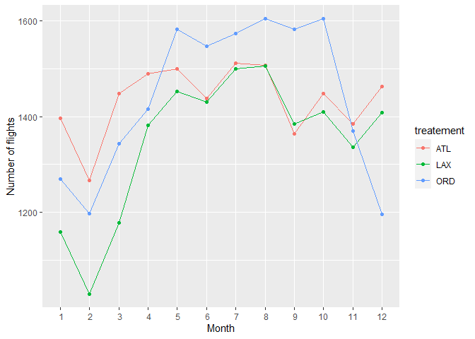

hw\_09
================
Haley Dylewski
10/26/2020

Practice in Functions and Programming

-----

Write functions that compute the variance and skewness of numeric vector

-----

This function calculates variance of a vector

Given the equation for variance is Var(x) = (1/n-1)\*sum((xi-X)^2, i=1
to n) where X is the mean and n is the number of data points

``` r
library(tidyverse)
```

    ## -- Attaching packages -------------------- tidyverse 1.3.0 --

    ## v ggplot2 3.3.2     v purrr   0.3.4
    ## v tibble  3.0.3     v dplyr   1.0.2
    ## v tidyr   1.1.2     v stringr 1.4.0
    ## v readr   1.3.1     v forcats 0.5.0

    ## -- Conflicts ----------------------- tidyverse_conflicts() --
    ## x dplyr::filter() masks stats::filter()
    ## x dplyr::lag()    masks stats::lag()

``` r
variance <- function(x){
n <- length(x)
X_bar <- mean(x)
var_sum <- 0
i <- 1
for (i in seq_along(x)){
  var_sum <- var_sum + ((x[i]-X_bar)^2)
}
Var <- (1/(n-1))*var_sum
Var
}

example <-c(1,2,3,4,5,6,7)
p <- variance(example)
p
```

    ## [1] 4.666667

This function calculates the skew of a vector

Given the equation for skew is skew = ((1/n-2)\*sum((x1-X)^3, i=1 to
n))/(var(x)^3/2)

``` r
skew_calculator <- function(x){
n <- length(x)
X_bar <- mean(x)
X_bar
sk_sum <- 0
i <- 1

for (i in seq_along(x)) {
  sk_sum <- sk_sum + (x[i]- X_bar)^3
}

var <- variance(x)
skew <- ((1/n-2)*sk_sum)/(var^(3/2))

}
```

Sample data set and function calls

``` r
sample <- c(1,2,3,4,5,6,7,8,9,10)
sample_var <- variance(sample)
sample_var
```

    ## [1] 9.166667

``` r
sample_skew <- skew_calculator(sample)
sample_skew
```

    ## [1] 0

-----

Write both\_na function that takes two vectors of the same length and
returns the number of position in both that have an NA.
\_\_\_\_\_\_\_\_\_\_\_\_\_\_\_\_\_\_\_\_\_\_\_\_\_\_\_\_\_\_\_\_\_\_\_\_\_\_\_\_\_\_\_\_\_\_\_\_\_\_\_\_\_\_\_\_

both\_na()

``` r
NA_counter <- function(x,y){
x_NA <-sum(is.na(x))
y_NA <-sum(is.na(y))
print(paste0("Total NA in vector 1 = ", x_NA))
print(paste0("Total NA in vector 2 = ", y_NA))
}
```

Sample data and function call

``` r
N <- 10
x_num <- round(rnorm(N, 0, 5))
x_num[rbinom(N, 1, 0.2) == 1] <- NA 
x_num
```

    ##  [1] NA  2 NA -4 -4  0 -7 NA -5  0

``` r
M<-10
y_num <- round(rnorm(N, 0, 5))
y_num[rbinom(M, 1, 0.2) == 1] <- NA 
y_num
```

    ##  [1]   1   0  -4   1  -8 -16  -5  -7   8  -2

``` r
NA_counter(x_num,y_num)
```

    ## [1] "Total NA in vector 1 = 3"
    ## [1] "Total NA in vector 2 = 0"

-----

Write a function to create a specific kind of plot, with useful labels
that can take a data frame as an argument

function for plotting flight data. The data to plot is the only variable
passed in. The function code can be easily changed for repurposing.
\_\_\_\_\_\_\_\_\_\_\_\_\_\_\_\_\_\_\_\_\_\_\_\_\_\_\_\_\_\_\_\_\_\_\_\_\_\_\_\_\_\_\_\_\_\_\_\_\_\_\_\_\_\_\_\_

``` r
flight_plot <- function (in_data){
  x_axis <- in_data$month
  x_title <- in_data$number_of_flights
  x_lim <- c(1:12,1)
  treatement<- in_data$dest
  y_title <- "Month"
  y_axis <- "Number of flights"


  
ggplot(top_dest, aes(x = month, y = number_of_flights, color = treatement)) + 
  geom_line() + geom_point() + 
  xlim(1,12) + scale_x_discrete(name = y_title, limits = x_lim) + scale_y_continuous(name = y_axis, labels=waiver())
}
```

Sample data and function call

``` r
dest_data <- nycflights13::flights %>%
  group_by(dest,month)%>%
  summarize(number_of_flights = n())
```

    ## `summarise()` regrouping output by 'dest' (override with `.groups` argument)

``` r
top_dest <- filter(dest_data, dest == "ORD" | dest == "ATL" | dest == "LAX")

flight_plot(top_dest)
```

    ## Warning: Continuous limits supplied to discrete scale.
    ## Did you mean `limits = factor(...)` or `scale_*_continuous()`?

    ## Scale for 'x' is already present. Adding another scale for 'x', which will
    ## replace the existing scale.

<!-- -->

-----

Write a function that takes one argument and does the following: if the
argument is a numeric vector, multiplies every number in the vector by 2
if the argument is a character vector, sorts the vector into
alphabetical order if the argument is anything else, issues an
informative warning and returns the argument unchanged

-----

``` r
num_vect <- c(1,2,3)
char_vect <- c('z','a','b','c')
bool_vect <- c(TRUE, FALSE, TRUE)

x <- bool_vect

vector_mod <- function(x){
class <- class(x)

if (class == "numeric"){
  x = x*2
  
}else if (class == "character"){
  x <- sort(x)
  
}else{
 warning("WARNING: Vector of invalid class. Must be of character or numerical class")
  x <- x
}

}
```

Sample data and function call

``` r
print("Modified numerical: ")
```

    ## [1] "Modified numerical: "

``` r
num.vect <- c(1,2,3)
num.mod <- vector_mod(num_vect)
num.mod
```

    ## [1] 2 4 6

``` r
print("Modified character:")
```

    ## [1] "Modified character:"

``` r
char.vect <- c('z','a','b','c')
char.mod <- vector_mod(char_vect)
char.mod
```

    ## [1] "a" "b" "c" "z"

``` r
print("Modified logical: ")
```

    ## [1] "Modified logical: "

``` r
bool.vect <- c(TRUE, FALSE, TRUE)
logi.mod <- vector_mod(bool_vect)
```

    ## Warning in vector_mod(bool_vect): WARNING: Vector of invalid class. Must be of
    ## character or numerical class

``` r
logi.mod
```

    ## [1]  TRUE FALSE  TRUE

-----

Write a function that tries to calculate the mean of a vector using
mean(). If that is successful, it returns the mean of the vector. If
mean() throws an error, it issues an informative message and returns the
input intact.

This function uses tryCatch to identify errors/warnings, if none are
encountered it returns the completed calculation of the passed argument
as X\_bar
\_\_\_\_\_\_\_\_\_\_\_\_\_\_\_\_\_\_\_\_\_\_\_\_\_\_\_\_\_\_\_\_\_\_\_\_\_\_\_\_\_\_\_\_\_\_\_\_\_\_\_\_\_\_\_

``` r
error_catcher <- function(code) {
  tryCatch(code,
    error = function(c) "error: Mean cannot be calculated",
    warning = function(c) "warning: Argument is not numeric or logical",
    finally = function(c) X_bar <- code
  )
}
```

Test condition and function call

``` r
num_vect <- c(1,2,3)
char_vect <- c('z','a','b','c')
bool_vect <- c(TRUE, FALSE, TRUE)


error_catcher(mean(num_vect))
```

    ## [1] 2

``` r
error_catcher(mean(char_vect))
```

    ## [1] "warning: Argument is not numeric or logical"

``` r
error_catcher(mean(bool_vect))
```

    ## [1] 0.6666667

Note that this function does not stop the averaging of logical since
these are stored in memory as integers and so do not throw a warning or
error.

-----

Use system.time() (or, if you want to be more advanced about it, the
bench or microbenchmark packages) to compare how long it takes to add
two, 1-million-element random vectors and store the result in a third
vector: a. Using the vectorized sum() operation b. Using a for loop with
a pre-allocated vector to store the results c. Using a for loop without
pre-allocating a vector to store the results

-----

Create vectors and call microbenchmark library

``` r
library(microbenchmark)
```

    ## Warning: package 'microbenchmark' was built under R version 4.0.3

``` r
v1 <- runif(n = 1000000, min = 1, max = 100)
v2 <-runif(n = 1000000, min = 1, max = 10)
```

Part a: using vectorized sum().

``` r
vec_sum <- NA
microbenchmark(
  vec_sum[1] <- sum(v1),
  vec_sum[2] <- sum(v2))
```

    ## Unit: milliseconds
    ##                   expr      min       lq     mean   median       uq      max
    ##  vec_sum[1] <- sum(v1) 1.035802 1.057601 1.083751 1.066101 1.091701 1.312401
    ##  vec_sum[2] <- sum(v2) 1.042701 1.059951 1.095034 1.073701 1.100900 1.424501
    ##  neval
    ##    100
    ##    100

Part b: Using a for loop with a pre-allocated vector to store the
results

``` r
premade.vec <- vector(mode = "integer", length = 2)

microbenchmark(
for (i in 1:1000000){
  premade.vec[1] = premade.vec[1]+v1[i]
  premade.vec[2] = premade.vec[2]+v2[i]
}
)
```

    ## Unit: milliseconds
    ##                                                                                                            expr
    ##  for (i in 1:1e+06) {     premade.vec[1] = premade.vec[1] + v1[i]     premade.vec[2] = premade.vec[2] + v2[i] }
    ##      min      lq     mean   median       uq      max neval
    ##  219.326 237.536 247.8846 244.7637 257.9587 291.3241   100

``` r
premade.vec
```

    ## [1] 5048027115  550891985

Part 3: Using a for loop without pre-allocating a vector to store the
result

``` r
new.vec <- NA
microbenchmark(
for (i in 1:1000000){
  new.vec[1] = new.vec[1]+v1[i]
  new.vec[2] = new.vec[2]+v2[i]
}
)
```

    ## Unit: milliseconds
    ##                                                                                            expr
    ##  for (i in 1:1e+06) {     new.vec[1] = new.vec[1] + v1[i]     new.vec[2] = new.vec[2] + v2[i] }
    ##       min       lq     mean   median       uq      max neval
    ##  220.4417 234.6692 247.3622 242.4447 258.1623 296.0426   100

Using vectorized sum is much faster than the for loop. Without
preallocating memory, the computation is much much slower.
